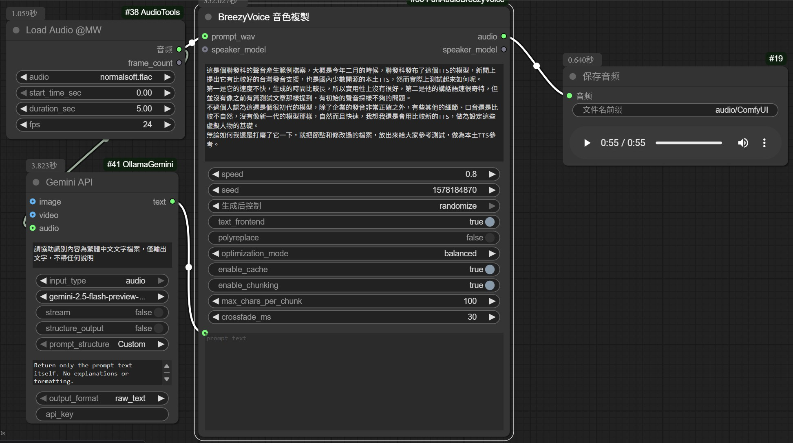

# 已支持[CosyVoice2](https://github.com/FunAudioLLM/CosyVoice)、[SenseVoice](https://github.com/FunAudioLLM/SenseVoice)、[InspireMusic](https://github.com/FunAudioLLM/InspireMusic)  
# 以原節點為基礎，添加支援聯發科的BreezyVoice [BreezyVoice](https://github.com/mtkresearch/BreezyVoice)  



## 使用說明：
 - 比起原始的BreezyVoice模型邏輯，預設採用FP16載入，VRAM僅占2-3GB
 - 會從HuggingFace自動下載、配置設定及模型，節點開箱即用，但Requirement須確實依說明安裝完成，如果你已經安裝過[IndexTTS](https://github.com/billwuhao/ComfyUI_IndexTTS) 只需要補上缺的需求項，其他全部都有了
 - 配合ListHelper節點組，每100字手動分段文字，合併聲音檔案，可採樣超過官方範例的語音長度，原長度僅支援15秒鐘，參考範例工作流設計  
 - 基礎設計邏輯請參考上面BreezyVoice的Github，需要有一個音聲檔案以及對應的字幕文本，音聲檔案可以任意節點載入，建議不要載入大於五秒鐘，會導致效能降低
 - 增加語速設定，語速設定為0.8，可改善原有模型音檔過快狀況

## 範例音檔：
 - 這是個聯發科的聲音產生範例檔案，大概是今年二月的時候，聯發科發布了這個TTS的模型，新聞上提出它有比較好的台灣發音支援，也是國內少數開源的本土TTS，然而實際上測試起來如何呢，第一是它的速度不快，生成的時間比較長，所以實用性上沒有很好，第二是他的講話語速很奇特，但並沒有像之前有篇測試文章那樣提到，有初始的聲音採樣不夠的問題，不過個人認為這還是個很初代的模型，除了企業的發音非常正確之外，有些其他的細節、口音還是比較不自然，沒有像新一代的模型那樣，自然而且快速，我想我還是會用比較新的TTS，做為設定這些虛擬人物的基礎，無論如何我還是打磨了它一下，就把節點和修改過的檔案，放出來給大家參考測試，做為本土TTS參考。

[🔊 聲音預覽](assets/sample.mp3)

## (原節點說明)新增内容：
 - 初步支持了inspiremusic，还没有经过严格测试（推理时有问题可以尝试换模型）。相应的新增了依赖，同时需要安装flash-attention（不使用InspireMusic可以不装），windows系统的whl可以从这里下载：
 ```
https://huggingface.co/lldacing/flash-attention-windows-wheel/tree/main
https://github.com/bdashore3/flash-attention/releases
 ```
 - 新增了是否自动下载模型的选项
 - 新增了多音字替换功能，配置在`funaudio_utils/多音字纠正配置.txt`。感谢https://github.com/touge/ComfyUI-NCE_CosyVoice/tree/main
 - 新增了3个CosyVoice2节点。
 - 整理了节点组。
 - 从官方更新了CosyVoice、SenseVoice、match。
 - 补充了更新CosyVoice后新增的参数`text_frontend`，作用应该是规范化文本，默认为`True`。
 - 优化了Speaker模型的保存与加载。
 - 因为CosyVoice2需要，采样率22050几乎全部改为了24000。
## 使用说明：
 - 工作流详见示例workflow
 - 建议自动下载模型，不熟悉的话容易重复下载（下载好之后强烈建议关闭自动下载）。
 - 手动下载请参考官方[CosyVoice](https://github.com/FunAudioLLM/CosyVoice)、[SenseVoice](https://github.com/FunAudioLLM/SenseVoice)、[InspireMusic](https://github.com/FunAudioLLM/InspireMusic)。手动下载后需要将inspiremusic.yaml文件里的'../../pretrained_models'替换成自己的模型路径。
 - Speaker模型默认存储在 `/models/CosyVoice/Speaker`
 - 当以Speaker模型做为输入时，保存模型依然生效，但是保存的模型应该没有数据。
## 安装注意事项：
 
 - 安装[ffmpeg](https://ffmpeg.org/)，并将ffmpeg.exe所在文件夹添加到环境变量。
 不需要使用Conda，從此下載WHL安裝pynini  [Pynini](https://github.com/billwuhao/pynini-windows-wheels/releases/tag/v2.1.6.post1)  

# 以下是原项目说明：
## ComfyUI-FunAudioLLM
Comfyui custom node for [FunAudioLLM](https://funaudiollm.github.io/) include [CosyVoice](https://github.com/FunAudioLLM/CosyVoice) and [SenseVoice](https://github.com/FunAudioLLM/SenseVoice)

## Features

### CosyVoice
  - CosyVoice Version: 2024-10-04
  - Support SFT,Zero-shot,Cross-lingual,Instruct
  - Support CosyVoice-300M-25Hz in zero-shot and cross-lingual
  - Support SFT's 25Hz(unoffical)
  - <details>
      <summary>Save and load speaker model in zero-shot</summary>
       <br>
      
    </details>

### SenseVoice
  - SenseVoice Version: 2024-10-04
  - Support SenseVoice-Small
  - <details>
      <summary>Support Punctuation segment (need turn off use_fast_mode)</summary>
       <br>
      
    </details>

## How use
```bash
apt update
apt install ffmpeg

## in ComfyUI/custom_nodes
git clone https://github.com/SpenserCai/ComfyUI-FunAudioLLM
cd ComfyUI-FunAudioLLM
pip install -r requirements.txt

```

### Windows
In windows need use conda to install pynini
```bash
conda install -c conda-forge pynini=2.1.6
pip install -r requirements.txt

```

### MacOS
If meet error when you install
```bash
brew install openfst
export CPPFLAGS="-I/opt/homebrew/include"
export LDFLAGS="-L/opt/homebrew/lib"
pip install -r requirements.txt
```

If your network is unstable, you can pre-download the model from the following sources and place it in the appropriate directory.

- [CosyVoice-300M](https://modelscope.cn/models/iic/CosyVoice-300M) -> `ComfyUI/models/CosyVoice/CosyVoice-300M`
- [CosyVoice-300M-25Hz](https://modelscope.cn/models/iic/CosyVoice-300M-25Hz) -> `ComfyUI/models/CosyVoice/CosyVoice-300M-25Hz`
- [CosyVoice-300M-SFT](https://modelscope.cn/models/iic/CosyVoice-300M-SFT) -> `ComfyUI/models/CosyVoice/CosyVoice-300M-SFT`
- [CosyVoice-300M-SFT-25Hz](https://modelscope.cn/models/MachineS/CosyVoice-300M-SFT-25Hz) -> `ComfyUI/models/CosyVoice/CosyVoice-300M-SFT-25Hz`
- [CosyVoice-300M-Instruct](https://modelscope.cn/models/iic/CosyVoice-300M-Instruct) -> `ComfyUI/models/CosyVoice/CosyVoice-300M-Instruct`
- [SenseVoiceSmall](https://modelscope.cn/models/iic/SenseVoiceSmall) -> `ComfyUI/models/SenseVoice/SenseVoiceSmall`
     
## WorkFlow


